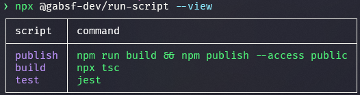

<p align="center">
  <a href="https://www.npmjs.com/package/@gabsf-dev/run-script"></a>
  <a href="https://github.com/gabsf-dev/run-script/blob/main/LICENSE"></a>
</p>
<p align="center">
  <a href="https://github.com/gabsf-dev/run-script/blob/main/.github/workflows/publish.yml"></a>
</p>

<!-- A spacer -->
<p>&nbsp;</p>

<h1 align="center">RunScript</h1>

The effortlessly way to run your package.json scripts

## Getting Started

To use RunScript it's simple as to run:

```bash
npx @gabsf-dev/run-script
```

Or to install globally:

```bash
npm i -g @gabsf-dev/run-script
```

and run it using:

```bash
run-script
```

After that, just choose the script that you want to run, and RunScript make the rest, since choosing `npm` or `yarn` to run your script based on the lock file present in the folder, to logging all of the script execution for you.

## Flags

RunScript provides the following flags:

- _-V, --version_

Logs the RunScript current version.

```bash
npx @gabsf-dev/run-script -V
```

- _-h, --help_

Logs the RunScript help.

```bash
npx @gabsf-dev/run-script -h
```

- _-v, --view_

Only show the scripts listed in your `package.json` in a table format.

```bash
npx @gabsf-dev/run-script --view
```

<p align="center">
  
</p>

- _--ai_

With the `--ai` flag, you can receive ai thoughts about the scripts presents in the `package.json`. It's a coming soon feature, so stay tuned for the future updates.

```bash
npx @gabsf-dev/run-script --ai
```

## License

RunScript is [MIT licensed](./LICENSE).

## Copyright

Copyright Contributors to the RunScript project.
